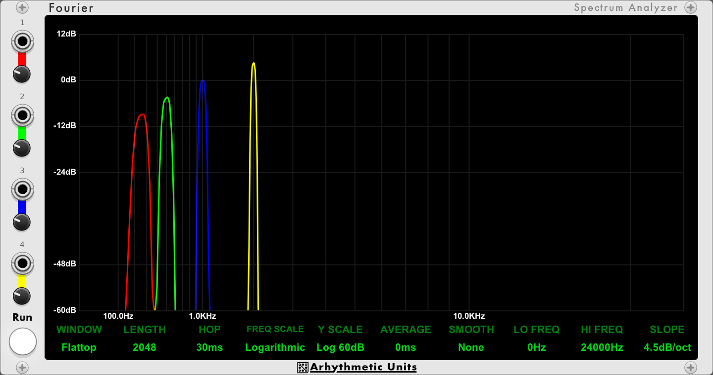
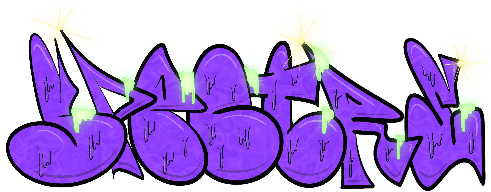
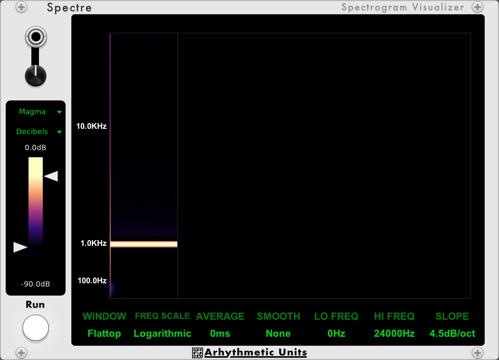

# Fourier

**See what your patch is doing.** Spectrum analysis and spectrograms for
VCV Rack 2, by **Arhythmetic Units**. Compare signals, explore harmonics,
and watch sound evolve with **Fourier**, a four-input spectrum analyzer,
and **Spectre**, a spectrogram visualizer.

[![Latest GitHub Release][ReleaseBadge]][LatestRelease]
[![DSP and Rack tests][TestsBadge]][TestsWorkflow]
[![VCV Library: Rack 2][VCVBadge]][VCVLibrary]
[![Source License: GPL-3.0-or-later][LicenseBadge]](LICENSING.md)

**[Get it on VCV Library][VCVLibrary]** ·
[Fourier manual (PDF)][Fourier] · [Spectre manual (PDF)][Spectre] ·
[Changelog](CHANGELOG.md)

Read the [**technical report source and build guide**][report] for the
analysis algorithms, FFT scheduling, and reproducible experiments.
[BibTeX citation](docs/whitepaper/CITATION.bib).

## Fourier: Spectrum Analyzer

<p align="center">
  
</p>

Compare up to four signals in one view. Isolate the bass, inspect harmonic
spacing, or check how a filter reshapes your sound.

<p align="center">
  
</p>

-   **Choose your resolution.** FFT lengths from 128 to 16384 samples and
    an adjustable hop size balance frequency detail against time detail.
-   **Find the shape of a sound.** Average over time or smooth across
    frequency to make broader trends easier to read.
-   **Frame the comparison.** Set frequency bounds, amplitude scale, and
    per-input gain; choose filled or unfilled traces and Bezier curves.

[Explore the Fourier manual][Fourier]

## Spectre: Spectrogram Visualizer

<p align="center">
  
</p>

Follow a signal through time. See a filter sweep, an oscillator's changing
harmonics, or the brief burst of energy at the start of a note.

<p align="center">
  
</p>

-   **Watch the history build.** A moving scan line writes new spectra
    across the display, revealing changes in frequency content.
-   **Choose your colors.** Seven color maps, including Magma, Viridis,
    and Cividis, let you change how spectral magnitude appears. Select
    Decibels or Linear intensity and adjust Floor and Ceil on the color
    screen to reveal quiet detail or separate strong peaks.
-   **Pause and inspect.** Freeze the history and hover for frequency,
    note, tuning offset, and magnitude readouts. Recolor the frozen view
    without capturing it again.

[Explore the Spectre manual][Spectre]

Both modules offer 15 window functions, time and frequency smoothing,
linear or logarithmic frequency axes, and adjustable display slope.
Spectre uses a fixed 2048-sample FFT and 1024-sample hop.

## Get Started

1.  With VCV Rack 2 installed, sign in to your VCV account and add the
    modules from the [VCV Library][VCVLibrary].
2.  Sign in through Rack's **Library** menu, choose **Update all**, and
    restart Rack after the download. Add **Fourier** or **Spectre** from
    the module browser.
3.  Connect a signal and keep **Run** lit. Load a factory preset from the
    module's preset menu, or start shaping the view with the panel controls.

These are visual analysis tools with no audio outputs. Patch your source
into the analyzer alongside your existing audio path. Polyphonic cables
are supported; voices within each input are summed into one spectrum.

Context-menu settings support Rack's **Undo** and **Redo**, including
AC coupling and Fourier's fill and Bezier options. Spectre's palette and
intensity-scale dropdowns are on the color screen and also support Undo
and Redo.

This README describes the current checkout. VCV Library builds and the
latest-release PDF manuals can lag behind it; see the [changelog](CHANGELOG.md)
for unreleased changes.

## Factory Presets

Start with a view suited to the task, then adjust it to your patch.
Both modules ship these five presets:

| Preset | Use It To... |
| --- | --- |
| `Mastering` | Read the broad tonal balance with smoothing and slope weighting. |
| `PluginDevelopment` | Inspect levels and artifacts without smoothing or slope weighting. |
| `BassDetail` | Focus on the bottom 500 Hz. |
| `Harmonics` | Inspect harmonic spacing on a linear frequency axis. |
| `Transients` | Follow changing spectra without time averaging. |

Spectre also includes `DecibelInspection`: a -90 to +12 dB color range,
with no smoothing or slope weighting, for inspecting spectral levels.

Spectre's analysis size is fixed; its presets change the view and smoothing.
Fourier's presets also tune FFT length and hop size.

<details>
<summary><strong>Preset Settings And Compatibility Notes</strong></summary>

Fourier and Spectre share the five presets in the table, using filenames
without spaces. Load them from Rack's module preset menu. Each pair uses the same
input gain (0 dB), window, frequency scale and bounds, smoothing, slope,
and AC coupling. All presets start running; Fourier uses unfilled traces
and Spectre uses Magma colors.

Spectre's five shared presets retain Linear intensity and their original
appearance. Its additional `DecibelInspection` preset selects Decibels,
Floor -90 dB, and Ceil +12 dB, with Flattop windowing, a linear 0-20 kHz
frequency axis, and AC coupling off. New Spectre instances use Decibels
with a -90 to 0 dB range; older patches without an intensity mode load in
Linear to preserve their colors.

| Preset | Purpose And Shared Settings | Fourier FFT / Hop |
| --- | --- | --- |
| `Mastering` | Broad tonal balance: Flattop, logarithmic 0-20 kHz, 300 ms averaging, 1/12-octave smoothing, +4.5 dB/oct slope, AC coupling. | 4096 / 30 ms |
| `PluginDevelopment` | Inspect levels and artifacts: Flattop, linear 0-20 kHz, no smoothing or slope, DC coupling. Fourier uses its 120 dB scale and straight traces. | 8192 / 30 ms |
| `BassDetail` | Inspect low-frequency content: Hann, linear 0-500 Hz, 100 ms averaging, no octave smoothing or slope, AC coupling. | 16384 / 30 ms |
| `Harmonics` | Inspect harmonic spacing: Hann, linear 0-5 kHz, no smoothing or slope, AC coupling. | 4096 / 20 ms |
| `Transients` | Follow changing spectra: Hann, logarithmic 0-20 kHz, no smoothing or slope, AC coupling. | 1024 / 5 ms |

Spectre always uses a 2048-sample FFT and a 1024-sample hop (about 43 ms
and 21 ms at 48 kHz). `BassDetail` zooms its display without increasing
frequency resolution, and `Transients` removes averaging without shortening
its fixed analysis window. Fourier's longer FFTs improve frequency resolution
at the cost of temporal detail and processing work. Apart from
`PluginDevelopment`, Fourier uses its 60 dB scale; only `Mastering` enables
Bezier curves. Spectre's colors are a separate magnitude representation,
so matching input gain does not imply matching display brightness.

Frequency bounds are explicit so loading a preset replaces a previous zoom.
The full-band presets stop at 20 kHz; raise HI Freq manually to inspect
content above that. Rack clamps bounds to Nyquist at lower sample rates.
`Mastering` retains its original smoothing and slope but uses a longer
Fourier FFT. `PluginDevelopment` now uses a linear frequency axis and a
deeper Fourier magnitude scale. Both Spectre presets replace the previous
+6 dB input boost with unity gain. The former Fourier filename
`Plugin Development.vcvm` is now `PluginDevelopment.vcvm`; saved patches
keep their embedded module settings.

</details>

## Support

See [SUPPORT.md](SUPPORT.md) for troubleshooting, questions, bug reports,
and feature requests. Include your Rack and plugin versions, operating
system, and steps to reproduce a problem.

## Development

See [CONTRIBUTING.md](CONTRIBUTING.md) for environment setup, architecture,
builds, tests, benchmarks, and the pull request workflow. The
[C++](docs/style-guides/cpp.md) and
[Markdown](docs/style-guides/markdown.md) style guides cover
coding and documentation conventions. Coding agents should also follow
[AGENTS.md](AGENTS.md).

## Citation

The [technical report][report], **Whole-Pipeline Scheduling for Real-Time
Spectral Analysis**, explains the implementation, scheduling and latency
model, prior work, and reproducible experiments. Its README includes build
instructions for the [LaTeX project](docs/whitepaper/fourier.tex) and its
self-contained source export.

Release [v2.1.2](https://github.com/Kautenja/ArhythmeticUnits-Fourier/releases/tag/v2.1.2)
includes both user manuals but no whitepaper PDF. Follow the
[report's build instructions][report] for a local PDF. The
[publication workflow](.github/workflows/manuals.yml) builds both
manuals and `Fourier-whitepaper.pdf` and attaches them when a release is
published.

<details>
<summary><strong>Citation Formats And Reproducibility</strong></summary>

For the implementation and scheduling analysis, cite the technical report.
GitHub's **Cite this repository** button uses the preferred report citation in
[CITATION.cff][citation-cff], and [CITATION.bib](docs/whitepaper/CITATION.bib)
supplies the same report entry.

```bibtex
@techreport{kauten2026fourier,
  author      = {Kauten, Christian},
  title       = {Whole-Pipeline Scheduling for Real-Time Spectral Analysis},
  institution = {Arhythmetic Units},
  year        = {2026},
  month       = sep,
  type        = {Technical report},
  note        = {Manuscript version 4; not yet deposited on arXiv},
  url         = {https://github.com/Kautenja/ArhythmeticUnits-Fourier/tree/main/docs/whitepaper},
}
```

The [code on GitHub](https://github.com/Kautenja/ArhythmeticUnits-Fourier) is
the report's supporting software artifact; no separate software citation is
needed. For reproducibility, link to the code and identify the software
version or commit you used. The report's experiment metadata records its
evaluated source revision.

The report is currently a repository manuscript. Its citation will be updated
with a persistent identifier after a public deposit; no arXiv identifier or
publication acceptance is implied.

### Citing The User Manuals

To reference a manual itself, use its dedicated BibTeX `@manual` entry:

-   [Fourier manual citation](docs/manual-fourier/CITATION.bib)
-   [Spectre manual citation](docs/manual-spectre/CITATION.bib)

These entries identify the author, manual title, version 2.2.0, release month,
and version-specific PDF URL. Cite the version you consulted; update the
metadata and URL if you use another release. Mathematical background and
algorithm references are collected in the [technical report][report];
the user manuals focus on operating the modules.

</details>

## Acknowledgments

Fourier builds on [VCV Rack][vcv-rack] for its modular synthesis host and
plugin framework, and uses [Catch2][catch2] for standalone C++ DSP tests.

The analysis algorithms draw on published DSP research discussed in the
[technical report][report]. If your work depends on these
methods, please also cite the relevant research:

-   **Fast Fourier Transform:** James W. Cooley and John W. Tukey,
    "An algorithm for the machine calculation of complex Fourier series,"
    *Mathematics of Computation*, 19(90), 297-301, 1965.
-   **Real-Valued FFT:** H. V. Sorensen, D. Jones, Michael Heideman, and
    C. Burrus, "Real-valued fast Fourier transform algorithms,"
    *IEEE Transactions on Acoustics, Speech, and Signal Processing*,
    35(6), 849-863, 1987.
-   **Short-Time Fourier Analysis:** J. B. Allen and L. R. Rabiner,
    "A unified approach to short-time Fourier analysis and synthesis,"
    *Proceedings of the IEEE*, 65(11), 1558-1564, 1977.

The report contains the shared bibliography and an implementation appendix
covering transform preparation and lookup tables.

## License

Source code is licensed under **GPL-3.0-or-later**. Module artwork and
Arhythmetic Units branding have separate **CC BY-NC-ND 4.0** terms.
See [LICENSING.md](LICENSING.md) for details.

[ReleaseBadge]: https://img.shields.io/github/v/release/Kautenja/ArhythmeticUnits-Fourier?label=GitHub%20release
[LatestRelease]: https://github.com/Kautenja/ArhythmeticUnits-Fourier/releases/latest
[TestsBadge]: https://github.com/Kautenja/ArhythmeticUnits-Fourier/actions/workflows/dsp-tests.yml/badge.svg?branch=main
[TestsWorkflow]: https://github.com/Kautenja/ArhythmeticUnits-Fourier/actions/workflows/dsp-tests.yml?query=branch%3Amain
[VCVBadge]: https://img.shields.io/badge/VCV-Rack%202-0099dd
[VCVLibrary]: https://library.vcvrack.com/ArhythmeticUnits-Fourier
[LicenseBadge]: https://img.shields.io/badge/source%20license-GPL--3.0--or--later-blue
[Fourier]: https://github.com/Kautenja/ArhythmeticUnits-Fourier/releases/latest/download/Fourier.pdf
[Spectre]: https://github.com/Kautenja/ArhythmeticUnits-Fourier/releases/latest/download/Spectre.pdf
[report]: docs/whitepaper/README.md
[citation-cff]: CITATION.cff
[vcv-rack]: https://github.com/VCVRack/Rack
[catch2]: https://github.com/catchorg/Catch2
