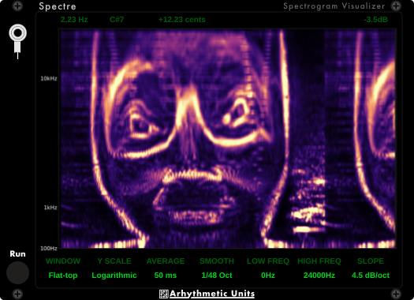

# Fourier

[![Latest Release][ReleaseBadge]][LatestRelease]
[![VCV Library][VCVBadge]][VCVLibrary]

[ReleaseBadge]: https://img.shields.io/github/v/release/Kautenja/ArhythmeticUnits-Fourier
[LatestRelease]: https://github.com/Kautenja/ArhythmeticUnits-Fourier/releases/latest
[VCVBadge]: https://img.shields.io/badge/VCV-Library-white
[VCVLibrary]: https://library.vcvrack.com/ArhythmeticUnits-Fourier

This repository contains the source code for the _Fourier_ plugin by
**Arhythmetic Units**.

<!-- ------------------------------------------------------------ -->
<!-- MARK: Fourier -->
<!-- ------------------------------------------------------------ -->

-----

<p align="center">

</p>

**Fourier** is a highly tune-able spectrum analyzer module.

<p align="center">

</p>

### Features

-   **Fully Parametric STFT:** Enjoy complete control over FFT length, hop
    size, and window function parameters, enabling precise tuning for a wide
    range of musical and engineering applications.
-   **Time \& Frequency Smoothing:** Apply smoothing in both the temporal and
    spectral domains to consolidate FFT coefficients, thereby highlighting
    overarching trends in signal frequency content.
-   **Slope Scaling:** Compensate for the natural roll-off of high-frequency
    energy, yielding a frequency representation that more accurately reflects
    human auditory perception.
-   **Intuitive Interface:** A streamlined control layout delivers deep
    functionality without the need for extensive menu diving or manual
    exploration.

See the [Manual][Fourier] for more information about the features of this module.

[Fourier]: https://github.com/Kautenja/ArhythmeticUnits-Fourier/releases/latest/download/Fourier.pdf

<!-- ------------------------------------------------------------ -->
<!-- MARK: Spectre -->
<!-- ------------------------------------------------------------ -->

-----

<p align="center">

</p>

**Spectre** is a highly tune-able spectrogram visualizer module.

<p align="center">

</p>

### Features

-   **Time \& Frequency Smoothing:** Apply smoothing in both the temporal and
    spectral domains to consolidate FFT coefficients, thereby highlighting
    overarching trends in signal frequency content.
-   **Slope Scaling:** Compensate for the natural roll-off of high-frequency
    energy, yielding a frequency representation that more accurately reflects
    human auditory perception.
-   **Intuitive Interface:** A streamlined control layout delivers deep
    functionality without the need for extensive menu diving or manual
    exploration.

See the [Manual][Spectre] for more information about the features of this module.

[Spectre]: https://github.com/Kautenja/ArhythmeticUnits-Fourier/releases/latest/download/Spectre.pdf

## Development

Start with [AGENTS.md](AGENTS.md) for coding-agent instructions and the
[developer guide](docs/developer-manual/development-and-testing.md) for
dependencies, builds, tests, and manual verification. The
[architecture map](docs/developer-manual/architecture.md) and
[C++ style guide](docs/developer-manual/style-guide-cpp.md) describe the
project's source structure and coding conventions.

## Citation

Please cite Fourier if you use it in your research or software. GitHub's
**Cite this repository** button reads the same metadata from
[CITATION.cff][citation-cff]. Cite the version you used; the entry below
describes version 2.1.2.

```bibtex
@software{kauten2025fourier,
  author  = {Kauten, Christian},
  title   = {{Fourier}: Spectrum Analysis and Spectrogram Visualization for {VCV Rack}},
  year    = {2025},
  version = {2.1.2},
  url     = {https://github.com/Kautenja/ArhythmeticUnits-Fourier},
  license = {GPL-3.0-or-later},
  note    = {Arhythmetic Units plugin containing the Fourier spectrum analyzer
             and Spectre spectrogram visualizer},
}
```

The citation's license field describes the source code. See
[LICENSE.md](LICENSE.md) for the separate terms covering visual assets.

## Acknowledgments

Fourier builds on [VCV Rack][vcv-rack] for its modular synthesis host and
plugin framework, and uses [Catch2][catch2] for standalone C++ DSP tests.

The analysis algorithms draw on published DSP research discussed in the
user manuals. If your work depends on these methods, please also cite the
relevant research:

-   **Fast Fourier Transform:** James W. Cooley and John W. Tukey,
    "An algorithm for the machine calculation of complex Fourier series,"
    *Mathematics of Computation*, 19(90), 297-301, 1965.
-   **Real-Valued FFT:** H. V. Sorensen, D. Jones, Michael Heideman, and
    C. Burrus, "Real-valued fast Fourier transform algorithms,"
    *IEEE Transactions on Acoustics, Speech, and Signal Processing*,
    35(6), 849-863, 1987.
-   **Short-Time Fourier Analysis:** J. B. Allen and L. R. Rabiner,
    "A unified approach to short-time Fourier analysis and synthesis,"
    *Proceedings of the IEEE*, 65(11), 1558-1564, 1977.

The [Fourier bibliography][fourier-bibliography] and
[Spectre bibliography][spectre-bibliography] contain reusable BibTeX entries
and further references on DSP, algorithms, and computer architecture.

[citation-cff]: CITATION.cff
[vcv-rack]: https://github.com/VCVRack/Rack
[catch2]: https://github.com/catchorg/Catch2
[fourier-bibliography]: manual/Fourier/references.bib
[spectre-bibliography]: manual/Spectre/references.bib
