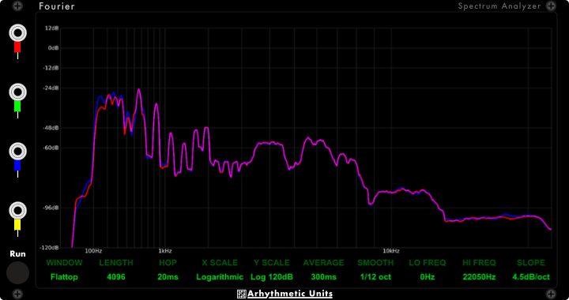

# Fourier

[![Latest Release][ReleaseBadge]][LatestRelease]
[![VCV Library][VCVBadge]][VCVLibrary]

[ReleaseBadge]: https://img.shields.io/github/v/release/Kautenja/ArhythmeticUnits-Fourier
[LatestRelease]: https://github.com/Kautenja/ArhythmeticUnits-Fourier/releases/latest
[VCVBadge]: https://img.shields.io/badge/VCV-Library-white
[VCVLibrary]: https://library.vcvrack.com/ArhythmeticUnits-Fourier

This repository contains the source code for the _Fourier_ plugin by
**Arhythmetic Units**.

Both modules support Rack's Undo and Redo commands for context-menu settings:
AC coupling, Fourier's fill and Bezier options, and Spectre's color map.

<!-- ------------------------------------------------------------ -->
<!-- MARK: Fourier -->
<!-- ------------------------------------------------------------ -->

-----

<p align="center">

</p>

**Fourier** is a highly tune-able spectrum analyzer module.

<p align="center">

</p>

### Features

-   **Fully Parametric STFT:** Enjoy complete control over FFT length, hop
    size, and window function parameters, enabling precise tuning for a wide
    range of musical and engineering applications.
-   **Time \& Frequency Smoothing:** Apply smoothing in both the temporal and
    spectral domains to consolidate FFT coefficients, thereby highlighting
    overarching trends in signal frequency content.
-   **Slope Scaling:** Compensate for the natural roll-off of high-frequency
    energy, yielding a frequency representation that more accurately reflects
    human auditory perception.
-   **Intuitive Interface:** A streamlined control layout delivers deep
    functionality without the need for extensive menu diving or manual
    exploration.

See the [Manual][Fourier] for more information about the features of this module.

[Fourier]: https://github.com/Kautenja/ArhythmeticUnits-Fourier/releases/latest/download/Fourier.pdf

<!-- ------------------------------------------------------------ -->
<!-- MARK: Spectre -->
<!-- ------------------------------------------------------------ -->

-----

<p align="center">

</p>

**Spectre** is a highly tune-able spectrogram visualizer module.

<p align="center">

</p>

### Features

-   **Time \& Frequency Smoothing:** Apply smoothing in both the temporal and
    spectral domains to consolidate FFT coefficients, thereby highlighting
    overarching trends in signal frequency content.
-   **Slope Scaling:** Compensate for the natural roll-off of high-frequency
    energy, yielding a frequency representation that more accurately reflects
    human auditory perception.
-   **Intuitive Interface:** A streamlined control layout delivers deep
    functionality without the need for extensive menu diving or manual
    exploration.

See the [Manual][Spectre] for more information about the features of this module.

[Spectre]: https://github.com/Kautenja/ArhythmeticUnits-Fourier/releases/latest/download/Spectre.pdf

## Factory Presets

Fourier and Spectre ship the same five preset names, using filenames without
spaces. Load them from Rack's module preset menu. Each pair uses the same
input gain (0 dB), window, frequency scale and bounds, smoothing, slope,
and AC coupling. All presets start running; Fourier uses unfilled traces
and Spectre uses Magma colors.

| Preset | Purpose And Shared Settings | Fourier FFT / Hop |
| --- | --- | --- |
| `Mastering` | Broad tonal balance: Flattop, logarithmic 0-20 kHz, 300 ms averaging, 1/12-octave smoothing, +4.5 dB/oct slope, AC coupling. | 4096 / 30 ms |
| `PluginDevelopment` | Inspect levels and artifacts: Flattop, linear 0-20 kHz, no smoothing or slope, DC coupling. Fourier uses its 120 dB scale and straight traces. | 8192 / 30 ms |
| `BassDetail` | Inspect low-frequency content: Hann, linear 0-500 Hz, 100 ms averaging, no octave smoothing or slope, AC coupling. | 16384 / 30 ms |
| `Harmonics` | Inspect harmonic spacing: Hann, linear 0-5 kHz, no smoothing or slope, AC coupling. | 4096 / 20 ms |
| `Transients` | Follow changing spectra: Hann, logarithmic 0-20 kHz, no smoothing or slope, AC coupling. | 1024 / 5 ms |

Spectre always uses a 2048-sample FFT and a 1024-sample hop (about 43 ms
and 21 ms at 48 kHz). `BassDetail` zooms its display without increasing
frequency resolution, and `Transients` removes averaging without shortening
its fixed analysis window. Fourier's longer FFTs improve frequency resolution
at the cost of temporal detail and processing work. Apart from
`PluginDevelopment`, Fourier uses its 60 dB scale; only `Mastering` enables
Bezier curves. Spectre's colors are a separate magnitude representation,
so matching input gain does not imply matching display brightness.

Frequency bounds are explicit so loading a preset replaces a previous zoom.
The full-band presets stop at 20 kHz; raise HI Freq manually to inspect
content above that. Rack clamps bounds to Nyquist at lower sample rates.
`Mastering` retains its original smoothing and slope but uses a longer
Fourier FFT. `PluginDevelopment` now uses a linear frequency axis and a
deeper Fourier magnitude scale. Both Spectre presets replace the previous
+6 dB input boost with unity gain. The former Fourier filename
`Plugin Development.vcvm` is now `PluginDevelopment.vcvm`; saved patches
keep their embedded module settings.

## Development

Start with [AGENTS.md](AGENTS.md) for coding-agent instructions and the
[developer guide](docs/developer-manual/development-and-testing.md) for
dependencies, builds, tests, and manual verification. The
[architecture map](docs/developer-manual/architecture.md) and
[C++ style guide](docs/developer-manual/style-guide-cpp.md) describe the
project's source structure and coding conventions.

## Citation

The [technical report](docs/whitepaper/README.md), **Fourier: Resumable FFT
Scheduling for Real-Time Spectral Analysis**, describes the implementation,
its scheduling and latency model, prior work, and reproducible experiments.
The self-contained [LaTeX source](docs/whitepaper/fourier.tex) builds with
`make -C docs/whitepaper`.

For the implementation and scheduling analysis, cite the technical report.
GitHub's **Cite this repository** button uses the preferred report citation in
[CITATION.cff][citation-cff], and [CITATION.bib](CITATION.bib) supplies the same
report entry.

```bibtex
@techreport{kauten2026fourier,
  author      = {Kauten, Christian},
  title       = {{Fourier}: Resumable {FFT} Scheduling for Real-Time Spectral Analysis},
  institution = {Arhythmetic Units},
  year        = {2026},
  month       = sep,
  type        = {Technical report},
  note        = {Manuscript version 1; not yet deposited on arXiv},
  url         = {https://github.com/Kautenja/ArhythmeticUnits-Fourier/tree/main/docs/whitepaper},
}
```

The [code on GitHub](https://github.com/Kautenja/ArhythmeticUnits-Fourier) is
the report's supporting software artifact; no separate software citation is
needed. For reproducibility, link to the code and identify the software
version or commit you used. The report's experiment metadata records its
evaluated source revision. The source-code license is GPL-3.0-or-later; see
[LICENSE.md](LICENSE.md) for the separate visual-asset terms.

The report is currently a repository manuscript. Its citation will be updated
with a persistent identifier after a public deposit; no arXiv identifier or
publication acceptance is implied.

### Citing The User Manuals

To reference a manual itself, use its dedicated BibTeX `@manual` entry:

-   [Fourier manual citation](docs/manual/Fourier/CITATION.bib)
-   [Spectre manual citation](docs/manual/Spectre/CITATION.bib)

These entries identify the author, manual title, version 2.1.2, release month,
and version-specific PDF URL. Cite the version you consulted; update the
metadata and URL if you use another release. Mathematical background and
algorithm references are collected in the [technical report](docs/whitepaper/README.md);
the user manuals focus on operating the modules.

## Acknowledgments

Fourier builds on [VCV Rack][vcv-rack] for its modular synthesis host and
plugin framework, and uses [Catch2][catch2] for standalone C++ DSP tests.

The analysis algorithms draw on published DSP research discussed in the
[technical report](docs/whitepaper/README.md). If your work depends on these
methods, please also cite the relevant research:

-   **Fast Fourier Transform:** James W. Cooley and John W. Tukey,
    "An algorithm for the machine calculation of complex Fourier series,"
    *Mathematics of Computation*, 19(90), 297-301, 1965.
-   **Real-Valued FFT:** H. V. Sorensen, D. Jones, Michael Heideman, and
    C. Burrus, "Real-valued fast Fourier transform algorithms,"
    *IEEE Transactions on Acoustics, Speech, and Signal Processing*,
    35(6), 849-863, 1987.
-   **Short-Time Fourier Analysis:** J. B. Allen and L. R. Rabiner,
    "A unified approach to short-time Fourier analysis and synthesis,"
    *Proceedings of the IEEE*, 65(11), 1558-1564, 1977.

The report contains the shared bibliography and an implementation appendix
covering transform preparation and lookup tables.

[citation-cff]: CITATION.cff
[vcv-rack]: https://github.com/VCVRack/Rack
[catch2]: https://github.com/catchorg/Catch2
