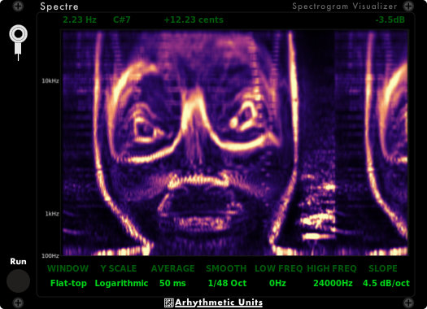

[![Latest Release][ReleaseBadge]][LatestRelease]
[![VCV Library][VCVBadge]][VCVLibrary]

[ReleaseBadge]: https://img.shields.io/github/v/release/Kautenja/ArhythmeticUnits-Fourier
[LatestRelease]: https://github.com/Kautenja/ArhythmeticUnits-Fourier/releases/latest
[VCVBadge]: https://img.shields.io/badge/VCV-Library-white
[VCVLibrary]: https://library.vcvrack.com/ArhythmeticUnits-Fourier

<!-- ------------------------------------------------------------ -->
<!-- MARK: Fourier -->
<!-- ------------------------------------------------------------ -->

**Fourier** is a highly tune-able spectrum analyzer module.

### Features

-   **Fully Parametric STFT:** Enjoy complete control over FFT length, hop
    size, and window function parameters, enabling precise tuning for a wide
    range of musical and engineering applications.
-   **Time \& Frequency Smoothing:** Apply smoothing in both the temporal and
    spectral domains to consolidate FFT coefficients, thereby highlighting
    overarching trends in signal frequency content.
-   **Slope Scaling:** Compensate for the natural roll-off of high-frequency
    energy, yielding a frequency representation that more accurately reflects
    human auditory perception.
-   **Intuitive Interface:** A streamlined control layout delivers deep
    functionality without the need for extensive menu diving or manual
    exploration.

See the [Manual][Fourier] for more information about the features of this module.

[Fourier]: https://github.com/Kautenja/ArhythmeticUnits-Fourier/releases/latest/download/Fourier.pdf

<!-- ------------------------------------------------------------ -->
<!-- MARK: Spectre -->
<!-- ------------------------------------------------------------ -->

**Spectre** is a highly tune-able spectrogram visualizer module.

### Features

-   **Time \& Frequency Smoothing:** Apply smoothing in both the temporal and
    spectral domains to consolidate FFT coefficients, thereby highlighting
    overarching trends in signal frequency content.
-   **Slope Scaling:** Compensate for the natural roll-off of high-frequency
    energy, yielding a frequency representation that more accurately reflects
    human auditory perception.
-   **Intuitive Interface:** A streamlined control layout delivers deep
    functionality without the need for extensive menu diving or manual
    exploration.

See the [Manual][Spectre] for more information about the features of this module.

[Spectre]: https://github.com/Kautenja/ArhythmeticUnits-Fourier/releases/latest/download/Spectre.pdf
